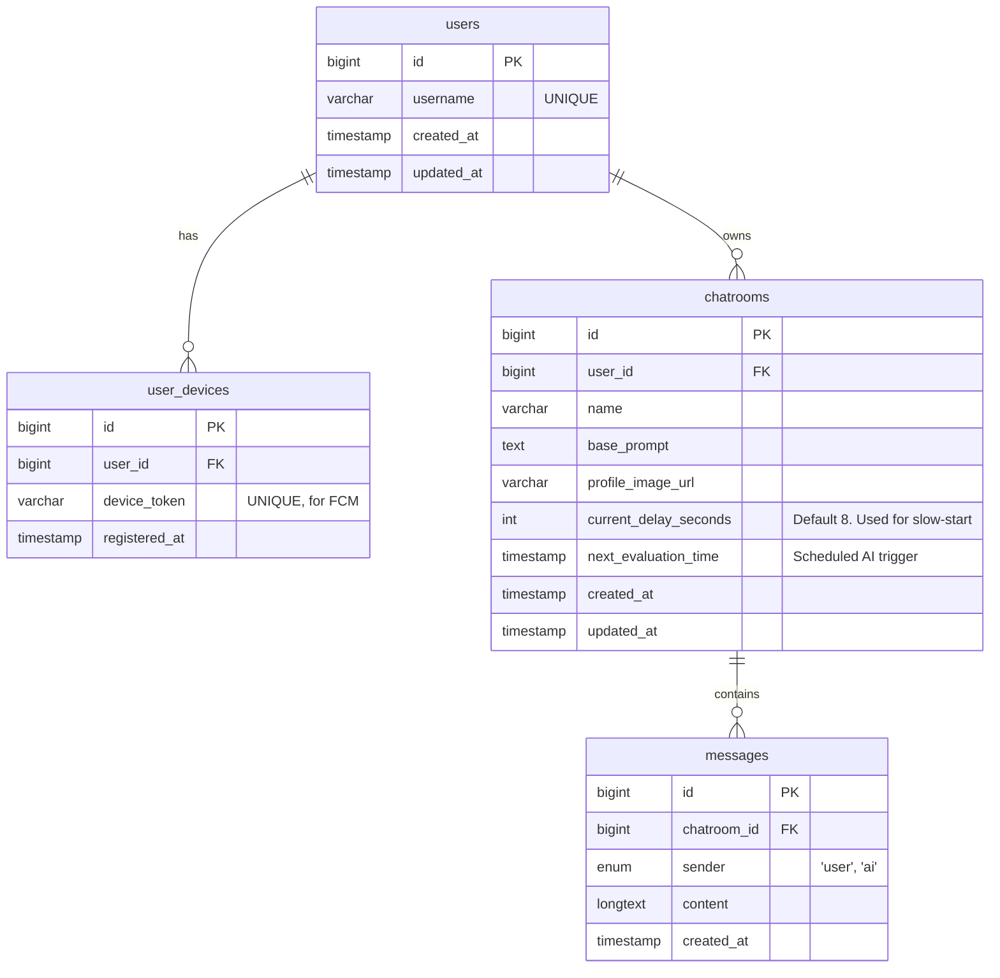

# Database Schema: Chatty

This document defines the MySQL database schema for the Chatty application. It is optimized for agentic coding, providing a declarative Mermaid Entity-Relationship (ER) diagram for conceptual understanding, followed by explicit MySQL Data Definition Language (DDL) statements for direct execution and migration generation.

## 1. Entity-Relationship Diagram



---

## 2. MySQL DDL Statements

The following SQL script contains the exact table definitions, constraints, and relationships. Agents can parse and use these blocks directly to perform database migrations or generate ORM entities.

```sql
-- -----------------------------------------------------
-- Table `users`
-- -----------------------------------------------------
CREATE TABLE IF NOT EXISTS users (
    id BIGINT AUTO_INCREMENT PRIMARY KEY,
    username VARCHAR(255) NOT NULL UNIQUE,
    created_at TIMESTAMP DEFAULT CURRENT_TIMESTAMP,
    updated_at TIMESTAMP DEFAULT CURRENT_TIMESTAMP ON UPDATE CURRENT_TIMESTAMP
);

-- -----------------------------------------------------
-- Table `user_devices` (For FCM Push Notifications)
-- -----------------------------------------------------
CREATE TABLE IF NOT EXISTS user_devices (
    id BIGINT AUTO_INCREMENT PRIMARY KEY,
    user_id BIGINT NOT NULL,
    device_token VARCHAR(255) NOT NULL UNIQUE,
    registered_at TIMESTAMP DEFAULT CURRENT_TIMESTAMP,
    CONSTRAINT fk_user_devices_user_id
        FOREIGN KEY (user_id)
        REFERENCES users(id)
        ON DELETE CASCADE
);

-- -----------------------------------------------------
-- Table `chatrooms`
-- Includes fields specifically for the AI slow-start
-- scheduling algorithm.
-- -----------------------------------------------------
CREATE TABLE IF NOT EXISTS chatrooms (
    id BIGINT AUTO_INCREMENT PRIMARY KEY,
    user_id BIGINT NOT NULL,
    name VARCHAR(255) NOT NULL,
    base_prompt TEXT,
    profile_image_url VARCHAR(255),
    current_delay_seconds INT DEFAULT 8,
    next_evaluation_time TIMESTAMP NULL,
    created_at TIMESTAMP DEFAULT CURRENT_TIMESTAMP,
    updated_at TIMESTAMP DEFAULT CURRENT_TIMESTAMP ON UPDATE CURRENT_TIMESTAMP,
    CONSTRAINT fk_chatrooms_user_id
        FOREIGN KEY (user_id)
        REFERENCES users(id)
        ON DELETE CASCADE
);

-- -----------------------------------------------------
-- Table `messages`
-- -----------------------------------------------------
CREATE TABLE IF NOT EXISTS messages (
    id BIGINT AUTO_INCREMENT PRIMARY KEY,
    chatroom_id BIGINT NOT NULL,
    sender ENUM('user', 'ai') NOT NULL,
    content LONGTEXT NOT NULL,
    created_at TIMESTAMP DEFAULT CURRENT_TIMESTAMP,
    CONSTRAINT fk_messages_chatroom_id
        FOREIGN KEY (chatroom_id)
        REFERENCES chatrooms(id)
        ON DELETE CASCADE
);
```

## 3. Agentic Implementation Notes

- **Primary Keys:** Standardized as auto-incrementing `BIGINT`. Adjust to UUID/ULID if the architecture demands decentralization, but `BIGINT` provides better indexing performance for MySQL.
- **Voluntary AI Messaging Logic:** The `chatrooms` table holds `current_delay_seconds` and `next_evaluation_time`. When a user posts a message, update `current_delay_seconds` back to `8` and compute `next_evaluation_time`. If the scheduled evaluation fails (decides not to send), multiply `current_delay_seconds` by 2 and recalculate `next_evaluation_time`.
- **Image Uploads:** `profile_image_url` on `chatrooms` holds the CDN/S3 URL indicating the reference after the Blob upload is resolved by the backend.
- **Constraints:** Foreign key cascading removes orphaned tokens, chatrooms, and messages when a parent entity is deleted.
